# Architecture

openvox-code is built around four core components that work together in a two-phase workflow.

## Core Components

### Fetcher

The Fetcher is responsible for cloning and updating Git repositories. It operates in parallel, fetching multiple repositories concurrently to minimize wall-clock time.

- Creates and maintains bare clone caches
- Supports SSH and HTTPS Git transports
- Handles branch discovery for dynamic environments
- Can be run independently via `openvox-code mirror`

### Resolver

The Resolver reads the configuration file and determines which modules, at which versions, need to be placed into which environments. It handles:

- Parsing `openvox-code.yaml` and optional lockfiles
- Resolving branch names and tags to concrete Git SHAs
- Computing the full dependency graph for each environment
- Detecting conflicts (e.g., duplicate module names from different sources)

### Deployer

The Deployer takes the resolved dependency graph and materializes it on disk. It:

- Checks out modules from the bare clone cache into environment directories
- Performs atomic deploys using temporary directories and renames
- Cleans up stale environments that no longer exist in the config or branches
- Can be run independently via `openvox-code deploy` (offline, from cache)

### Builder (OCI)

The Builder packages deployed environments into OCI container images for use with openvox-operator or any OCI-compatible runtime.

- Produces standard OCI images with Puppet code as the filesystem layer
- Supports tagging and pushing to container registries
- Run via `openvox-code build`

## Two-Phase Workflow

openvox-code separates network operations (fetching) from local operations (deploying). This separation enables offline deployments and makes the tool more reliable in air-gapped or restricted environments.

### Phase 1: Mirror

Fetch all Git repositories into the local bare clone cache. This is the only phase that requires network access.

```bash
openvox-code mirror --config openvox-code.yaml
```

### Phase 2: Deploy

Read from the local cache and write environments to disk. No network access required.

```bash
openvox-code deploy --config openvox-code.yaml
```

### Combined

The `sync` command runs both phases in sequence:

```bash
openvox-code sync --config openvox-code.yaml
```

## Flow Diagram

```mermaid
graph LR
    A[openvox-code.yaml] --> B[Resolver]
    B --> C[Fetcher]
    C -->|parallel git fetch| D[Bare Clone Cache]
    D --> E[Deployer]
    E -->|atomic write| F[Environment Directories]
    F --> G[Builder]
    G --> H[OCI Image]

    style A fill:#ff9800,color:#000
    style D fill:#ff9800,color:#000
    style F fill:#ff9800,color:#000
    style H fill:#ff9800,color:#000
```



The dashed path from Environment Directories to Builder is optional — OCI image output is only used when deploying to Kubernetes via openvox-operator.

## Directory Layout

After a successful sync, the on-disk layout looks like:

```
/etc/puppetlabs/code/environments/
├── production/
│   ├── manifests/
│   ├── modules/
│   │   ├── stdlib/
│   │   ├── apache/
│   │   └── ...
│   └── environment.conf
├── staging/
│   ├── manifests/
│   ├── modules/
│   └── environment.conf
└── development/
    ├── manifests/
    ├── modules/
    └── environment.conf

/var/cache/openvox-code/
├── git/
│   ├── github.com-puppetlabs-puppetlabs-stdlib.git/
│   ├── github.com-puppetlabs-puppetlabs-apache.git/
│   └── ...
└── locks/
```
